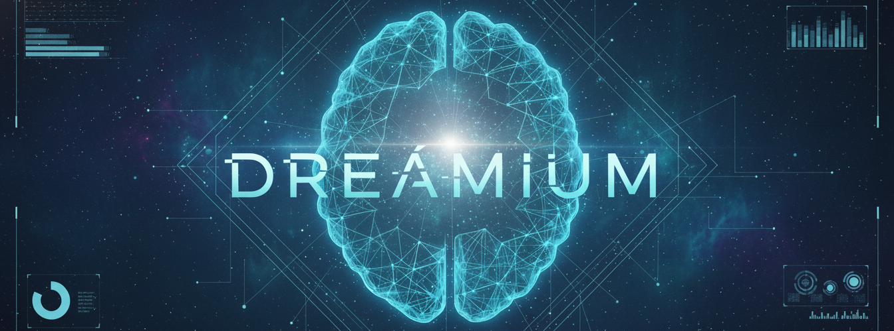

# Dreamium - AI-Powered Dream Insight Lab
> **Language / Dil:** [English](#) | [Türkçe](./README.tr.md)

**An evidence-based, multilingual dream analysis application combining AI with established psychological and neuroscientific research frameworks.**

[](https://nextjs.org/)
[](https://www.typescriptlang.org/)
[](./LICENSE)

---
<div align="center">
  
</div>


## Table of Contents

- [Overview](#overview)
- [Scientific Foundation](#scientific-foundation)
  - [Quantitative Analysis (Hall-Van de Castle)](#1-quantitative-analysis-hall-van-de-castle)
  - [REM Sleep Analysis](#2-rem-sleep-analysis)
  - [Continuity Hypothesis](#3-continuity-hypothesis)
  - [Demographic Normalization](#4-demographic-normalization)
  - [Bizarreness Detection](#5-bizarreness-detection)
  - [Psychological Frameworks](#6-psychological-frameworks)
  - [Bias Mitigation](#7-bias-mitigation)

---


## Overview

Dreamium is a Next.js 14 application that delivers **scientifically-grounded dream analysis** with:

- **7 integrated analysis engines** (quantitative, REM, continuity, emotion, bizarreness, psychological frameworks, bias mitigation)
- **Multilingual support** (Turkish/English) with culturally-adapted interpretations
- **Demographic normalization** for age, gender, and cultural background
- **Evidence-based interventions** with scientific references
- **Real-time analysis pipeline** with progress tracking

> **⚠️ Learning Project Notice**: This is an educational project for learning purposes. The code and analysis results should be reviewed and validated before any clinical or research use. This project serves as a demonstration of dream analysis techniques and should not be considered a production-ready clinical tool.
>
> **📚 Reference Note**: While this project references established dream research methodologies, all scientific references should be independently verified for accuracy and current validity before use in academic or clinical contexts.
> Although my goal is to develop a scientifically sound project, I am not a scientist; therefore, the project results should not be considered final or definitive without expert review.

---

## Scientific Foundation

### 1. Quantitative Analysis (Hall-Van de Castle)

**Implementation**: [`lib/quantitative-analysis.ts`](lib/quantitative-analysis.ts)

Based on the **Hall-Van de Castle (HVdC) coding system** (Hall & Van de Castle, 1966), the gold standard in dream content analysis.

#### **Methodology**:

```typescript
interface HallVdCMetrics {
  characters: {
    total: number;
    male: number;
    female: number;
    familiar: number;
    unfamiliar: number;
  };
  socialInteractions: {
    friendly: number;    // Talking, hugging, helping
    aggressive: number;  // Fighting, arguing, threatening
    sexual: number;      // Kissing, romantic contact
  };
  emotions: {
    positive: number;
    negative: number;
    neutral: number;
  };
  settings: {
    indoor: number;
    outdoor: number;
    familiar: number;
    unfamiliar: number;
  };
}
```

#### **Detection Logic**:

- **Character Detection**: Pattern matching for human references, gender markers, age indicators
- **Social Interactions**:
  - **Friendly**: Talking, helping, hugging, smiling, animal communication, teaching actions
  - **Aggressive**: Fighting, arguing, threatening, attacking
  - **Sexual**: Kissing, embracing, romantic relationships
- **Setting Detection**: Indoor (`home|room|building`) vs. Outdoor (`park|forest|street`)

---

### 2. REM Sleep Analysis

**Implementation**: [`lib/rem-sleep-analysis.ts`](lib/rem-sleep-analysis.ts)

Estimates sleep stage (REM/NREM) based on neurobiological sleep research.

#### **Methodology**:

```typescript
interface REMSleepMetrics {
  estimatedSleepStage: 'REM' | 'NREM' | 'unknown';
  dreamVividness: number;        // 0-100 (sensory richness + bizarreness)
  emotionalIntensity: number;    // 0-100
  bizarrenessScore: number;      // 0-100 (semantic anomalies)
  narrativeCoherence: number;    // 0-100
  memoryIncorporation: number;   // 0-100
  temporalDistortion: number;    // 0-100
}
```

#### **REM vs. NREM Classification**:

| Feature | REM Dreams | NREM Dreams |
|---------|------------|-------------|
| **Vividness** | High (70-100%) | Low (20-50%) |
| **Bizarreness** | High (50-100%) | Low (0-30%) |
| **Emotion** | Intense | Mild |
| **Narrative** | Complex | Simple |
| **Length** | Long (>100 words) | Short (<50 words) |

**Classification Formula**:

```typescript
const remScore = (vividness * 0.3) + (bizarreness * 0.4) + (emotionalIntensity * 0.2) + (length * 0.1)
// remScore > 60 = REM, remScore < 40 = NREM, otherwise unknown
```

#### **Circadian Analysis**:

- **Early night (21:00-01:00)**: 30% REM probability
- **Middle night (01:00-04:00)**: 50% REM probability
- **Late night (04:00-07:00)**: 70% REM probability (longest REM periods)

---

### 3. Continuity Hypothesis

**Implementation**: [`lib/continuity-hypothesis.ts`](lib/continuity-hypothesis.ts)

Tests **Domhoff's Continuity Hypothesis** (1996): Dreams reflect waking-life concerns, relationships, and experiences.

#### **Methodology**:

```typescript
interface ContinuityAnalysisResult {
  continuityScore: number; // 0-100 (how much dream reflects waking life)
  wakingLifeConnections: {
    personalConcerns: string[];    // Work, family, health, money
    recentExperiences: string[];   // Travel, events, conversations
    ongoingStressors: string[];    // Deadlines, conflicts, issues
    socialRelationships: string[]; // Friends, family, colleagues
  };
  continuityTypes: {
    thematic: number;    // Theme continuity (work→work)
    emotional: number;   // Emotion continuity (stress→anxiety)
    social: number;      // Character continuity (real people)
    cognitive: number;   // Problem continuity (waking problem→dream)
  };
}
```

#### **Detection Categories**:

- **Work concerns**: Job, boss, salary, meeting, project, deadline, workplace
- **Family concerns**: Mother, father, spouse, child, family, marriage, home
- **Health concerns**: Sick, doctor, hospital, pain, medicine, treatment
- **Financial concerns**: Money, debt, spending, salary, payment, bill

#### **Continuity Score Formula**:

```typescript
continuityScore = (
  (thematicContinuity * 0.4) +
  (emotionalContinuity * 0.3) +
  (socialContinuity * 0.2) +
  (realityTesting * 0.1)
)
```

---

### 4. Demographic Normalization

**Implementation**: [`lib/bias-mitigation.ts`](lib/bias-mitigation.ts), [`components/DemographicsForm.tsx`](components/DemographicsForm.tsx)

Normalizes analysis results based on demographic factors to reduce algorithmic bias.

#### **Collected Demographics**:

```typescript
interface Demographics {
  age: number;                     // 20-70
  gender: 'male' | 'female' | 'other' | 'prefer_not_to_say';
  culturalBackground: 'turkish' | 'western' | 'eastern' | 'mixed' | 'other';
  educationLevel: 'elementary' | 'secondary' | 'university' | 'graduate';
  sleepQuality: 'poor' | 'fair' | 'good' | 'excellent';
  stressLevel: 'low' | 'moderate' | 'high';
}
```

#### **Normalization Strategy**:

**1. Gender Normalization**:
- **Male**: Boost emotional theme detection (+15% confidence)
- **Female**: Boost technical theme detection (+20% confidence)
- **Goal**: Counter gender stereotypes in dream interpretation

**2. Age Normalization**:
- **Young adults (<30)**: Boost traditional themes (+15%)
- **Older adults (>50)**: Boost technology themes (+10%)
- **Goal**: Avoid ageist assumptions

**3. Cultural Normalization**:
- **Turkish/Eastern**: Boost family/collective themes (+20%)
- **Western**: Normalize individualism themes (-10%)
- **Goal**: Respect collectivist vs. individualist cultural values

#### **Privacy Note**: All demographic data is stored **locally in browser localStorage only**. No data is sent to external servers.

---

### 5. Bizarreness Detection

**Implementation**: [`lib/analysis/nlp/bizarreness-detector.ts`](lib/analysis/nlp/bizarreness-detector.ts)

Detects semantic anomalies in dream narratives using **5-category semantic analysis**.

#### **Bizarreness Categories**:

```typescript
interface BizarrenessAnalysis {
  totalScore: number; // 0-100
  categories: {
    physical: number;      // 0-100 (flying, passing through walls)
    cognitive: number;     // 0-100 (telepathy, omniscience)
    metamorphosis: number; // 0-100 (human→animal, object→person)
    spaceTime: number;     // 0-100 (time loops, teleportation)
    identity: number;      // 0-100 (face shifting, age changing)
  };
  detectedPatterns: Array<{
    category: string;
    description: string;
    severity: number;
  }>;
}
```

#### **Scoring System**:

- Each detected pattern adds **8-18 points** based on severity
- **Total score** = Sum of all pattern scores (capped at 100)
- **REM indicator**: Bizarreness > 50% strongly suggests REM sleep

---

### 6. Psychological Frameworks

**Implementation**: [`lib/advanced-dream-analysis.ts`](lib/advanced-dream-analysis.ts)

Provides multi-framework psychological interpretation using **4 major theoretical perspectives**.

#### **Frameworks**:

**1. Jungian Analysis**:

```typescript
interface JungianAnalysis {
  dominant_archetypes: string[];     // Shadow, Self, Anima/Animus, Wise Old Man, Hero
  archetypal_conflicts: string[];
  individuation_stage: string;
}
```

**2. Freudian Analysis**:

```typescript
interface FreudianAnalysis {
  repressed_content: string[];
  sexual_symbolism: string[];
  defense_mechanisms: string[];
  unconscious_desires: string[];
}
```

**3. Adlerian Analysis**:

```typescript
interface AdlerianAnalysis {
  power_dynamics: string[];
  inferiority_feelings: string[];
  striving_for_superiority: string[];
  social_interest: string[];
}
```

**4. Gestalt Analysis**:

```typescript
interface GestaltAnalysis {
  disowned_parts: string[];
  unfinished_business: string[];
  integration_suggestions: string[];
}
```

---

### 7. Bias Mitigation

**Implementation**: [`lib/bias-mitigation.ts`](lib/bias-mitigation.ts)

Algorithmic bias detection and correction system.

#### **Mitigation Strategies**:

- **Gender corrections**: Adjust theme weights to counter stereotypes
- **Age corrections**: Normalize technology/tradition theme balance
- **Cultural corrections**: Adjust family/individual theme emphasis
- **Confidence penalty**: Reduce confidence score by 10% when bias detected (max 75%)

---

## Architecture

### Analysis Approaches

Dreamium uses a **hybrid analysis approach** for optimal performance, accuracy, and cost-efficiency:

#### 🤖 AI-Powered Analyses

1. **Quantitative Analysis** ([`lib/quantitative-analysis.ts`](lib/quantitative-analysis.ts))
   - Uses AI for complex Hall-Van de Castle content coding
   - **Why AI?** Character identification and social interaction classification requires semantic understanding

2. **User Summary Generation** ([`lib/user-friendly-summary.ts`](lib/user-friendly-summary.ts))
   - Generates human-friendly psychological insights
   - **Why AI?** Natural language generation and empathetic communication

**Configuration**: Both analyses use customizable system prompts in Settings → System Messages

#### ⚡ Rule-Based Analyses

1. **Emotion Analysis** ([`lib/emotion-analysis.ts`](lib/emotion-analysis.ts))
   - Uses `affect_lexicon.json` for emotion keyword detection
   - **Why rule-based?** Emotion keywords are well-defined; lexicon lookup is instant and accurate

2. **REM Sleep Analysis** ([`lib/rem-sleep-analysis.ts`](lib/rem-sleep-analysis.ts))
   - Applies neurobiological formulas from sleep research
   - **Why rule-based?** Scientific formulas are deterministic; no AI needed for calculation

3. **Continuity Hypothesis** ([`lib/continuity-hypothesis.ts`](lib/continuity-hypothesis.ts))
   - Pattern matching for waking-life themes (work, family, health, etc.)
   - **Why rule-based?** Theme detection via keywords is fast and sufficient

---

## Tech Stack

### Core

- **Next.js 14** (App Router) - React framework
- **TypeScript 5.0** (strict mode) - Type safety
- **React 18** - UI library

### UI

- **Tailwind CSS** - Utility-first styling
- **Radix UI** - Accessible component primitives
- **Framer Motion** - Animations
- **Recharts** - Data visualization

### AI Integration (Optional)

- **Ollama** - Self-hosted models (recommended, no API key required)
- **OpenRouter API** - Multi-model access (optional, configured via Settings UI)

---

## Getting Started

### Prerequisites

- Node.js 18+ and npm

### Installation

1. **Clone the repository**:
   ```bash
   git clone https://github.com/SKBv0/dreamium.git
   cd dreamium
   ```

2. **Install dependencies**:
   ```bash
   npm install
   ```

3. **Create environment file**:
   ```bash
   cp .env.example .env.local
   ```

4. **Run development server**:
   ```bash
   npm run dev
   ```

   Open [http://localhost:9059](http://localhost:9059)

### Available Commands

```bash
npm run dev              # Start development server (port 9059)
npm run build            # Create production build
npm run start            # Run production server
npm run lint             # Run ESLint
npm run typecheck        # TypeScript check
npm run clean            # Remove .next and cache
npm run rebuild          # Clean + build
npm run validate-config  # Validate pattern configurations
```

---

## Project Structure

```
dreamium/
├── app/                          # Next.js App Router
│   ├── api/                      # API endpoints
│   │   ├── analyze/              # Main analysis endpoint
│   │   ├── ai/generate/          # AI summary generation
│   │   ├── history/              # Analysis history CRUD
│   │   └── keys/                 # API key management
│   ├── page.tsx                  # Main page
│   └── layout.tsx                # Root layout
│
├── components/                   # React components
│   ├── ui/                       # Radix UI primitives
│   ├── page/                     # Page-specific components
│   └── DemographicsForm.tsx      # 6-step demographics form
│
├── lib/                          # Core analysis engines
│   ├── analysis/                 # NLP analysis modules
│   ├── quantitative-analysis.ts  # Hall-Van de Castle
│   ├── rem-sleep-analysis.ts     # REM/NREM classification
│   ├── continuity-hypothesis.ts  # Domhoff's continuity
│   ├── emotion-analysis.ts       # Emotion detection
│   ├── bias-mitigation.ts        # Demographic normalization
│   └── translations.ts           # i18n strings (TR/EN)
│
├── config/                       # Configuration files
│   ├── patterns.tr.json          # Turkish patterns
│   ├── patterns.en.json          # English patterns
│   └── active.json               # Active locale
│
└── .data/                        # User data (gitignored)
    ├── analysis_history/         # Historical analyses
    └── analysis_log.json         # Latest analysis
```

---

## Disclaimer

- Results are **exploratory hypotheses**, not clinical diagnoses
- Requires user interpretation and contextual understanding
- Cultural and individual differences must be considered
- Bias mitigation reduces algorithmic bias but cannot eliminate it entirely

---

## License

Dreamium is released under the **MIT License**.

```
MIT License

Copyright (c) 2025 Dreamium Contributors

Permission is hereby granted, free of charge, to any person obtaining a copy
of this software and associated documentation files (the "Software"), to deal
in the Software without restriction...
```

---

## Acknowledgments

**Research Foundations**:

- Hall & Van de Castle (1966) - Quantitative dream content analysis
- Domhoff (1996-2018) - Continuity hypothesis and dream neuroscience
- Hobson & McCarley (1977) - Activation-synthesis hypothesis
- Nielsen (2000) - REM/NREM mentation differences
- Revonsuo (2000) - Evolutionary function of dreaming
